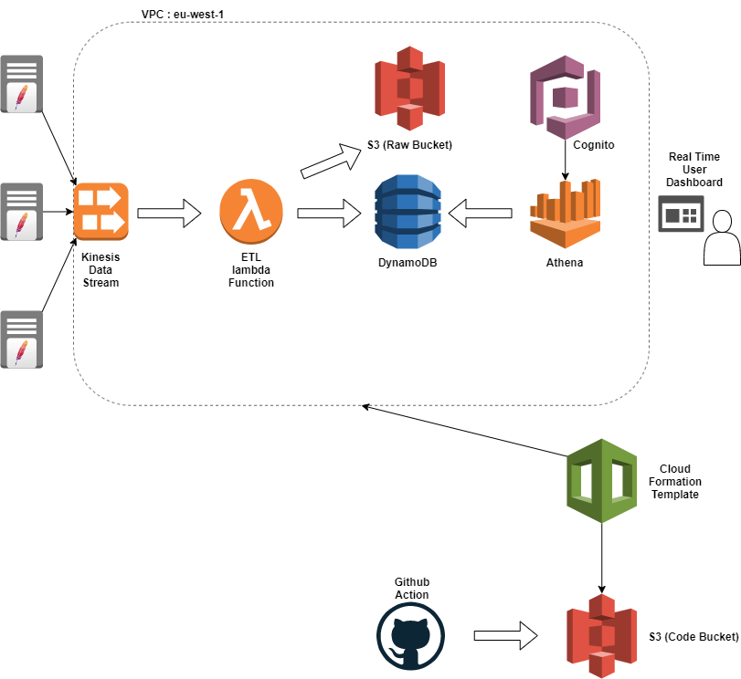

## Real time analytics of apache web logs using AWS Kinesis and DynamoDB
--------------------------------------------------------------------------

 

**Name: Darren Foley**

**Last Modified Date: 2021-10-17**

**Start Date: 2021-10-13**

 

#### 1.0 Project Description

**1.1 Introduction**

In this project a real time streaming application was created in AWS. The purpose of the application was to perform real time analytics on apache web logs generated in real time from a global e-commerce website. Currently, only a single geographic region is in scope for this project. If this project is successful then it will be rolled out to other regions so the pipeline will need to be flexible in order to handle additonal load (Emphasis on serverless technologies) 

 

**1.2 High Level Architecture Diagram**

Description: A github action is triggered when code is committed to source control. Code is pushed to an S3 bucket with contains the SAM files for a cloud formation template along with lambda source code etc. When the cloud formation template is activated, the pipeline is deployed. The log producers can then be switched on and logs can be sent to Kinesis. ETL is then performed on the data using a lambda function which enriches and cleans the data. After enrichment, the output is then loaded into DynamoDB for storage. Data is also sent to an S3 bucket in CSV format. A real-time dashboard was created in AWS Athena, which looks at important performance metrics such as 'number of 50X errors' or 'top page hits'.

 

#### 2.0 Sections

1. [Project Scope](docs/ProjectScope.md)

2. [Exploration of the Data](docs/DataExploration.md)

3. [Data Model](docs/DataModel.md)

4. [ETL Design](docs/ETLDesign.md)

